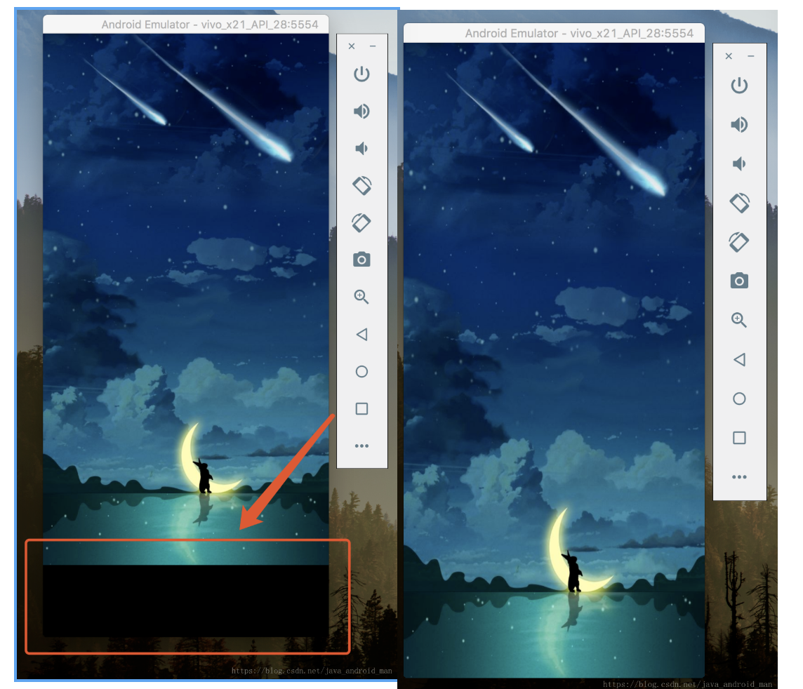
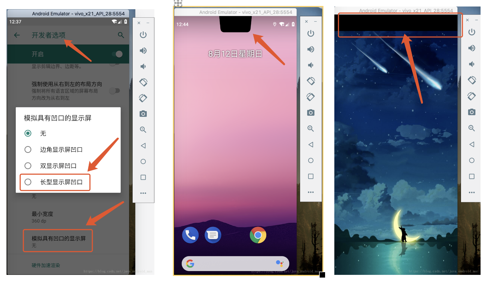
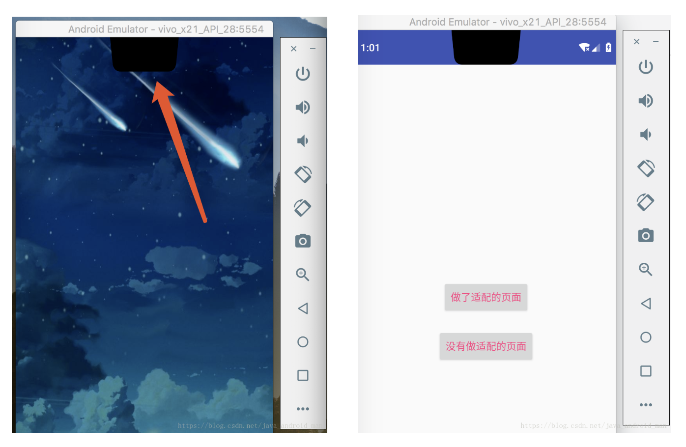
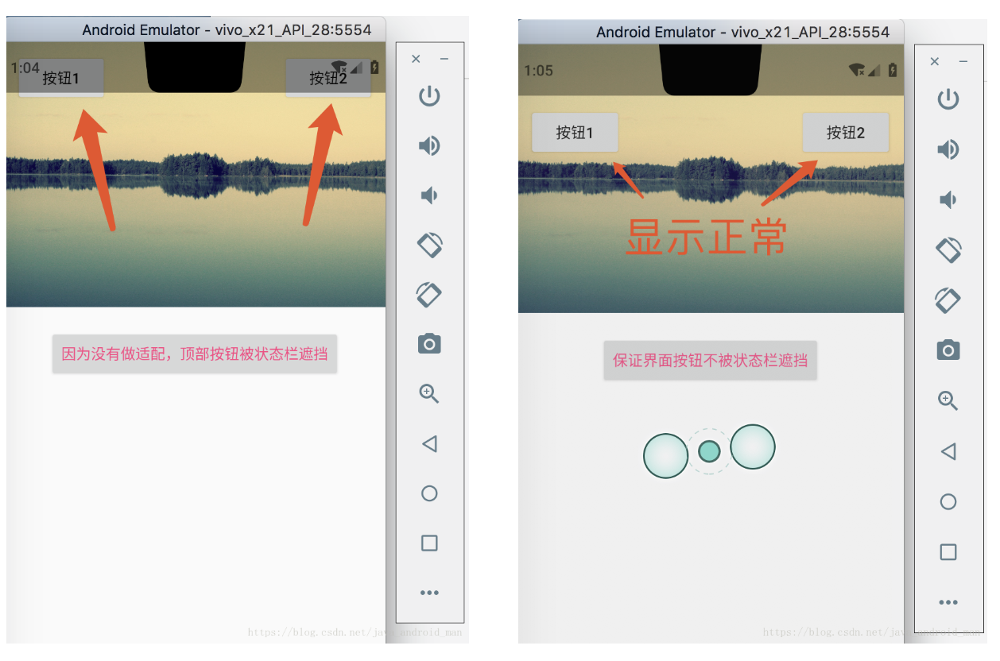

# AdaptNotch
### [我的博客地址](https://blog.csdn.net/java_android_man/article/details/81516487)
适配安卓P刘海屏

安卓P版本也就是刚发布的安卓9.0。
其中就加入了刘海屏相关的API。其相关行为与功能变更也是非常多的，从其变更的趋势及功能来看，google在进一步的收紧权限。

其P版本变更行为中就加入了对非SDK接口使用的新限制。无论是直接，通过反射还是通过JNI。只要应用程序引用非SDK接口或尝试使用反射或JNI获取其句柄，就会应用这些限制。通常，应用程序应仅使用SDK中类的官方记录部分。特别是，这意味着当您通过诸如反射之类的语义与类交互时，您不应该计划访问SDK中未列出的方法或字段。使用此类方法或字段存在破坏应用程序的高风险。

对于非sdk行为的限制，其中googel列出了灰名单/黑名单，其对于的方法和属性非常之多，目前还没来得及查找。当然谷歌也提供了检查我们应用中是否含有这些非限制的行为，具体办法见https://developer.android.google.cn/about/versions/pie/restrictions-non-sdk-interfaces。当然这个不是我们今天要讲的重点，对于非sdk行为的限制我会再抽时间好好研究后再发布一篇该博客。

在安卓P发布公测版到7月底，想必不少开发者都收到了来自各大应用市场发来的邮件。

邮件内容以其中一家为例（具体市场名称已隐匿）：

尊敬的开发者：
您好！为保障用户的使用体验，应用市场已在3月启动Android P版本应用适配检测工作，
针对未做适配的应用开发者陆续进行邮件通知。
请于2018年7月底前务必完成Android  P版本适配工作并自检通过。
针对未适配或在Android P版本体验欠佳的应用，
应用市场将在Android  P版本机型上采取屏蔽或不推荐更新策略，
可能会对您的推广、用户口碑及品牌产生影响。
相关技术资料见：https://developer.android.google.cn/preview/overview.html
请各相关开发者及时调整。
这样就导致我们不得不去适配安卓P了。

在收到邮件后，查阅谷歌官方的资料，更新SDK。其中UI最大的改变就是需要适配刘海屏。

但是国内厂商为了快速抢占全面屏手机市场，在安卓系统8.1的基础上，硬件就弄出了刘海屏，例如华为nova 3e, oneplus 6, oppo r15, vivo x21，但是系统支持没有更上，没有一个统一的API。但发现他们的分辨率都出奇的接近，就像达成了默契，2280 * 1080，高宽比达到了2.1。

今天就来说说怎么适配安卓8.1及P上的刘海屏。

首先下载谷歌最新的SDK API 28及系统镜像。新建API 28的模拟器后，自定义分辨率，高宽比最好设置为2以上，比如2280 * 1080。安卓系统默认支持的宽高比是1.7-1.8左右。具体多少值忘记了。有同学知道的在下方留言哦。但是现在出现了比值大于1.8了会出现什么情况呢？那我先给大家放一张没有做适配较大宽高比应用出现的情况的样子：



左边是compileSdkVersion 为25，targetSdkVersion为22的时候的情形。右边是compileSdkVersion 为28，targetSdkVersion为28的正常需要显示的场景，模拟器分辨率为1080 * 2280。那为何在最下方出现黑色区域呢？

正如前面说到的安卓系统默认支持的宽高比是1.7-1.8左右，现在流行的全面屏手机分辨率宽高比大于了这个数，导致屏幕区域不能利用完全，就出现了黑色区域。解决办法也很简单。

- 就是将编译版本compileSdkVersion升到24以上，目标版本targetSdkVersion升到24以上；
- 如果不愿升级targetSdkVersion，可以在AndroidManifest.xml中application节点下设置android:resizeableActivity="true"
```
<application
        android:name=".App"
        android:allowBackup="true"
        android:icon="@mipmap/ic_launcher"
        android:label="@string/app_name"
        android:resizeableActivity="true"
        android:roundIcon="@mipmap/ic_launcher_round"
        android:theme="@style/AppTheme">
```

- 或者在AndroidManifest.xml中application中设置
```
<!-- Render on full screen up to screen aspect ratio of 2.4 -->
<!-- Use a letterbox on screens larger than 2.4 -->
<meta-data android:name="android.max_aspect" android:value="2.4" />
```

刘海屏
有刘海屏真机的同学可以跳过这部分，首先在设置中打开“开发者选项”，找到“绘图”，找到“模拟具有凹口的显示屏”，选择“长型显示屏凹口”。如图：

             
第二张图就是开启模拟选项后显示的切口样式，当然这个缺口是模拟的，目前真机普遍的刘海屏高度在90px左右，安卓模拟器模拟的刘海屏高度为144px。后面的图是开启一个应用的闪屏页没有适配刘海屏的高度时候的样子，顶部出现了黑色区域。这个黑色区域是因为刘海缺口导致的整个界面整体向下移。因为我们的闪屏页一般都是会全屏显示，那我们就需要适配刘海屏上的全屏样式了。

#### 坐好了，我要开始吹一波了。
```
 <style name="theme_loading" parent="@android:style/Theme.Light.NoTitleBar.Fullscreen">
        <item name="android:windowBackground">@drawable/loading</item>
    </style>
```
闪屏页的样式我设置了全屏

代码中这样判断：
```
 /**
     * adapt fullScreen mode
     *
     * @param mActivity a
     */
    public static void openFullScreenModel(Activity mActivity) {
        try {
            if (Build.VERSION.SDK_INT >= 28) {
                mActivity.requestWindowFeature(Window.FEATURE_NO_TITLE);
                WindowManager.LayoutParams lp = mActivity.getWindow().getAttributes();
                lp.layoutInDisplayCutoutMode = WindowManager.LayoutParams.LAYOUT_IN_DISPLAY_CUTOUT_MODE_SHORT_EDGES;
                mActivity.getWindow().setAttributes(lp);
                View decorView = mActivity.getWindow().getDecorView();
                int systemUiVisibility = decorView.getSystemUiVisibility();
                int flags = View.SYSTEM_UI_FLAG_LAYOUT_FULLSCREEN
                        | View.SYSTEM_UI_FLAG_HIDE_NAVIGATION
                        | View.SYSTEM_UI_FLAG_FULLSCREEN;
                systemUiVisibility |= flags;
                mActivity.getWindow().getDecorView().setSystemUiVisibility(systemUiVisibility);
            }
        } catch (Exception e) {
            e.printStackTrace();
        }
    }
```
如果是需要全屏显示的activity，就需要调用这个方法。这样设置后我们的内容区域就可以全屏显示了。如下图：

       
最右边是进入的主页。

我另外又同时为大家准备了另外一个适配场景，其中做了适配和没有做适配的页面如下图：

       
想必大家从以上2个场景中也能总结出刘海屏的适配规则了：

就是界面的重要元素（例如按钮）不能被状态栏遮挡，需要充分的利用状态栏的显示区域。
这个也是根据场景而定，如果你的界面最顶部元素不需要侵入状态栏，那就只需要关注设置了全屏样式的activity的适配。否则你还得继续做一部分适配工作。那我们来看看显示正常的activity代码：
```
/**
 * Author：William Time：2018/8/12
 * Class Comment：has handled cutout
 */
public class HasAdaptActivity extends AppCompatActivity {

    @Override
    protected void onCreate(Bundle savedInstanceState) {
        StatusBarManager.setStatusBar(this, true);
        super.onCreate(savedInstanceState);
        setContentView(R.layout.activity_has_adapt);

        // adapt cutout
        int pH = DisplayCutoutUtil.getStatusBarHeight(this);
        RelativeLayout.LayoutParams params = new RelativeLayout.LayoutParams(
                ViewGroup.LayoutParams.MATCH_PARENT, ViewGroup.LayoutParams.WRAP_CONTENT);
        params.topMargin = pH;
        findViewById(R.id.rl_top).setLayoutParams(params);
    }
}
/**
     * get statusBar height
     *
     * @param context c
     * @return h
     */
    public static int getStatusBarHeight(Context context) {
        try {
            int result = 0;
            int resourceId = context.getResources().getIdentifier("status_bar_height", "dimen", "android");
            if (resourceId > 0) {
                result = context.getResources().getDimensionPixelSize(resourceId);
            }
            Log.d(TAG, "getStatusBarHeight==========>" + result);
            return result;
        } catch (Exception e) {
            e.printStackTrace();
        }
        return 0;
    }
```
layout.xml
```
<?xml version="1.0" encoding="utf-8"?>
<RelativeLayout xmlns:android="http://schemas.android.com/apk/res/android"
    xmlns:tools="http://schemas.android.com/tools"
    android:layout_width="match_parent"
    android:layout_height="match_parent"
    android:orientation="vertical"
    tools:context=".activity.NoAdaptActivity">

    <ImageView
        android:id="@+id/iv_image"
        android:layout_width="match_parent"
        android:layout_height="250dp"
        android:scaleType="centerCrop"
        android:src="@drawable/image" />

    <Button
        android:id="@+id/button"
        style="@style/tv_wrapContent.txt14"
        android:layout_below="@+id/iv_image"
        android:layout_centerHorizontal="true"
        android:layout_marginTop="20dp"
        android:text="保证界面按钮不被状态栏遮挡" />

    <RelativeLayout
        android:id="@+id/rl_top"
        android:layout_width="match_parent"
        android:layout_height="wrap_content">

        <Button
            android:layout_width="wrap_content"
            android:layout_height="wrap_content"
            android:layout_margin="10dp"
            android:text="按钮1" />

        <Button
            android:layout_width="wrap_content"
            android:layout_height="wrap_content"
            android:layout_alignParentRight="true"
            android:layout_margin="10dp"
            android:text="按钮2" />

    </RelativeLayout>
</RelativeLayout>
```
另外处理状态栏的工具类就不贴出来了，大家可以去文章最后的地址去下载。

代码大家一看就明白，就是给最顶部的按钮设置了一个marginTop即可，值即为状态栏的高度，通过代码设置可以直接适配所有版本。

另外附上厂商提供的适配方案：

华为官方适配方案：http://mini.eastday.com/bdmip/180411011257629.html
oppo官方适配方案：https://open.oppomobile.com/wiki/doc#id=10159
vivo官方适配方案：https://dev.vivo.com.cn/documentCenter/doc/103
谷歌适配指南：https://developer.android.google.cn/about/versions/pie/
结合华为，oppo，vivo 的适配文档，较为完整的处理缺口适配工具类代码如下：
```
package com.william.adaptnotch.utils;

import android.app.Activity;
import android.content.Context;
import android.os.Build;
import android.util.Log;
import android.view.View;
import android.view.Window;
import android.view.WindowManager;

import java.lang.reflect.Method;

/**
 * 作者：William 时间：2018/7/23
 * 类说明：adapt cutout utils
 */
public class DisplayCutoutUtil {

    private static final String TAG = "DisplayCutoutUtil";

    /**
     * adapt fullScreen mode
     *
     * @param mActivity a
     */
    public static void openFullScreenModel(Activity mActivity) {
        try {
            if (needAdaptNotch(mActivity)) {
                mActivity.requestWindowFeature(Window.FEATURE_NO_TITLE);
                WindowManager.LayoutParams lp = mActivity.getWindow().getAttributes();
                if (Build.VERSION.SDK_INT >= 28) {
                    lp.layoutInDisplayCutoutMode = WindowManager.LayoutParams.LAYOUT_IN_DISPLAY_CUTOUT_MODE_SHORT_EDGES;
                }
                mActivity.getWindow().setAttributes(lp);
                View decorView = mActivity.getWindow().getDecorView();
                int systemUiVisibility = decorView.getSystemUiVisibility();
                int flags = View.SYSTEM_UI_FLAG_LAYOUT_FULLSCREEN
                        | View.SYSTEM_UI_FLAG_HIDE_NAVIGATION
                        | View.SYSTEM_UI_FLAG_FULLSCREEN;
                systemUiVisibility |= flags;
                mActivity.getWindow().getDecorView().setSystemUiVisibility(systemUiVisibility);
            }
        } catch (Exception e) {
            e.printStackTrace();
        }
    }

    /**
     * need to adapt Notch screen
     *
     * @return true otherwise false
     */
    private static boolean needAdaptNotch(Context c) {
        return Build.VERSION.SDK_INT >= 28 || isHuaweiNotch(c) || isOppoNotch(c) || isVivoNotch(c);
    }

    /**
     * huawei
     *
     * @param context c
     * @return hasNotch
     */
    private static boolean isHuaweiNotch(Context context) {
        boolean ret = false;
        try {
            ClassLoader cl = context.getClassLoader();
            Class HwNotchSizeUtil = cl.loadClass("com.huawei.android.util.HwNotchSizeUtil");
            Method get = HwNotchSizeUtil.getMethod("hasNotchInScreen");
            ret = (boolean) get.invoke(HwNotchSizeUtil);
        } catch (ClassNotFoundException e) {
            Log.e("test", "hasNotchInScreen ClassNotFoundException");
        } catch (NoSuchMethodException e) {
            Log.e("test", "hasNotchInScreen NoSuchMethodException");
        } catch (Exception e) {
            Log.e("test", "hasNotchInScreen Exception");
        }
        return ret;
    }

    /**
     * OPPO
     *
     * @param context Context
     * @return hasNotch
     */
    private static boolean isOppoNotch(Context context) {
        try {
            return context.getPackageManager().hasSystemFeature("com.oppo.feature.screen.heteromorphism");
        } catch (Exception e) {
            e.printStackTrace();
        }
        return false;
    }

    /**
     * VIVO
     * param:
     * 0x00000020表示是否有凹槽;
     * 0x00000008表示是否有圆角。
     *
     * @param context Context
     * @return hasNotch
     */
    private static boolean isVivoNotch(Context context) {
        boolean hasNotch = false;
        try {
            ClassLoader cl = context.getClassLoader();
            Class FtFeature = cl.loadClass("android.util.FtFeature");
            Method get = FtFeature.getMethod("isFeatureSupport");
            hasNotch = (boolean) get.invoke(FtFeature, new Object[]{0x00000020});
        } catch (Exception e) {
            e.printStackTrace();
        }
        return hasNotch;
    }

    /**
     * get statusBar height
     *
     * @param context c
     * @return h
     */
    public static int getStatusBarHeight(Context context) {
        try {
            int result = 0;
            int resourceId = context.getResources().getIdentifier("status_bar_height", "dimen", "android");
            if (resourceId > 0) {
                result = context.getResources().getDimensionPixelSize(resourceId);
            }
            Log.d(TAG, "getStatusBarHeight==========>" + result);
            return result;
        } catch (Exception e) {
            e.printStackTrace();
        }
        return 0;
    }

}
```
OK，关于安卓P刘海屏的适配就介绍到这里了。其他关于全屏播放视频大家可以自己试试。欢迎大家留言与讨论！！！

